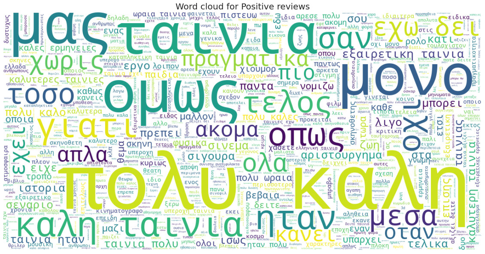

# Sentiment_Analysis
Sentiment Analysis in Greek movie reviews with pretrained Large Language Models.

**Finetuned Models**:
* ***BERT***
* ***T5***
* ***GPT2***

***Data Analysis***
A total of 150.000 movie reviews from Athinorama with 3 main sentiments positive-negative-neutral.
Ratings from 6481 unique movies.
(https://www.athinorama.gr/)
(https://www.kaggle.com/datasets/nikosfragkis/greek-movies-dataset)

Below are Wordcloud visualization for positive and negative reviews 

***Model Performance***

